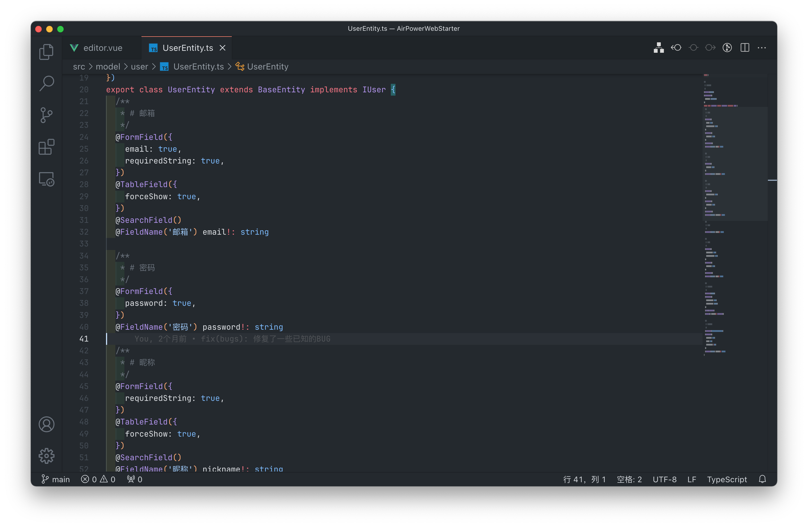
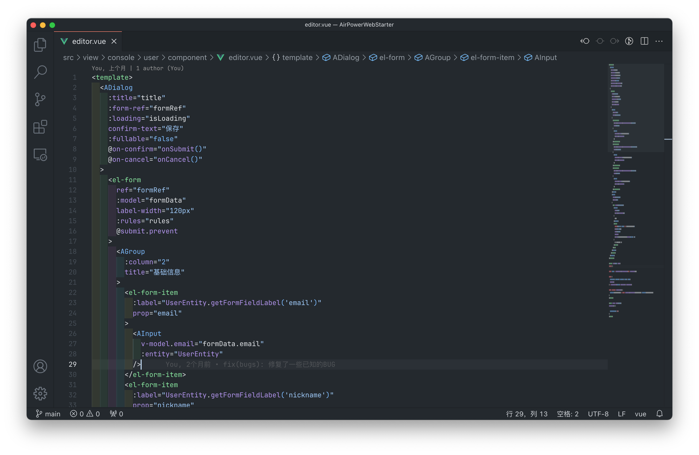
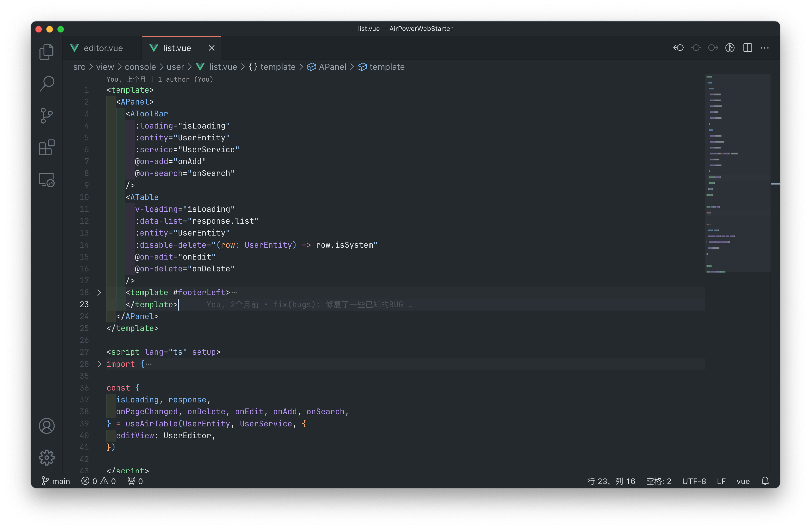
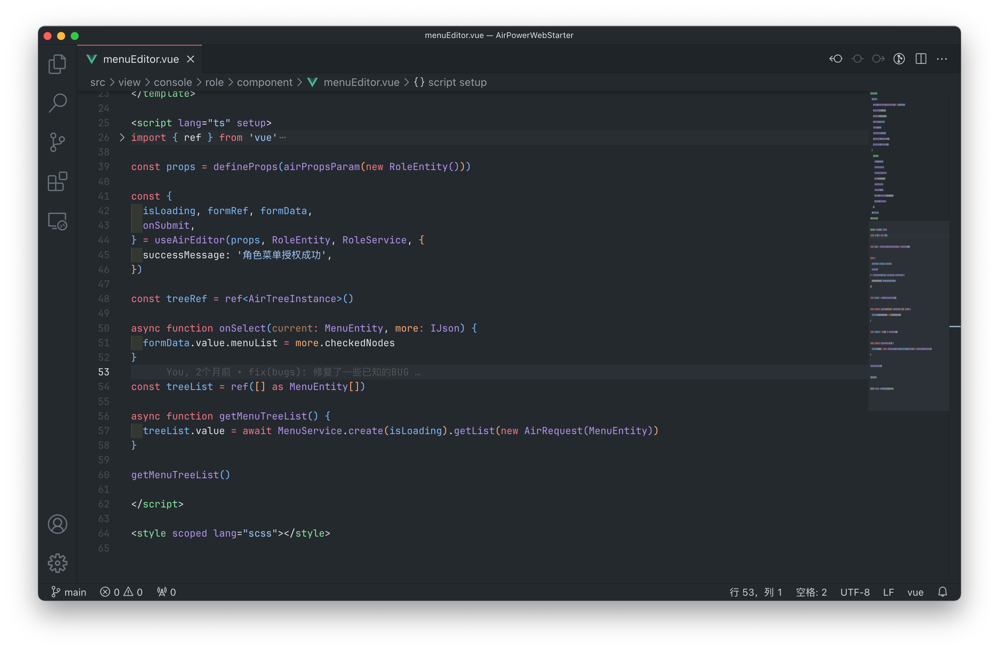
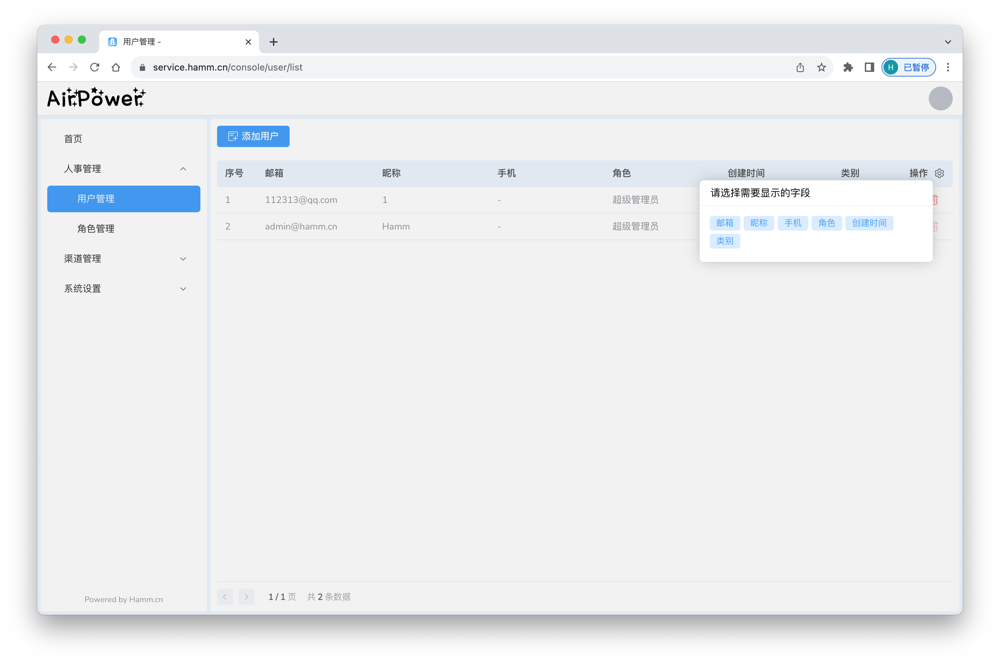
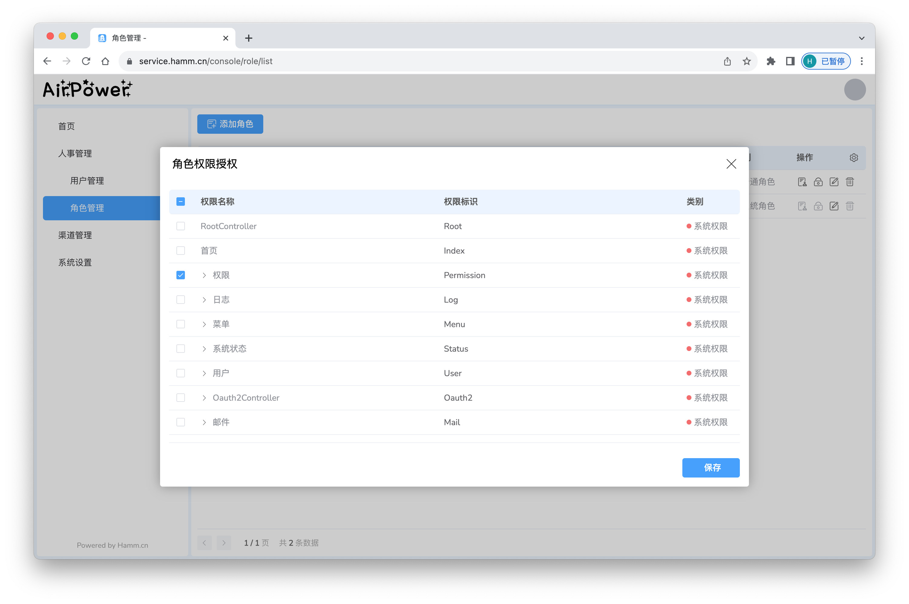
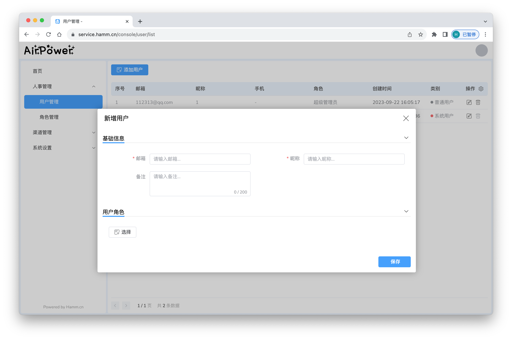

<p align="center">
   <b>4T</b>
</p>

<p align="center">
  
  
  
  
</p>

<p align="center"><a href="https://github.com/HammCn/AirPower4T">Github</a> /
  <a href="https://gitee.com/air-power/AirPower4T">Gitee</a> /  <a href="./CHANGELOG.md">CHANGELOG</a> / <a href="./docs/README.md">DOCUMENT</a>
</p>

## 1️⃣ 这是个什么项目

> 你当前查看的是 `web` 分支，我们也同时提供了 `wechat`、`uniapp` 等分支：）
> 你可以先阅读 [掘金专栏](https://juejin.cn/post/7273290114921889807)
> 的一些文章，也可以体验 [线上示例DEMO](https://service.hamm.cn)，如果你喜欢这个项目，欢迎给我们大大的 ⭐️⭐️⭐️

>
如需只使用工具包，可以使用我们提供的单独抽离的工具包项目 [AirPower@Github](https://github.com/HammCn/AirPower) / [AirPower@Gitee](https://gitee.com/air-power/AirPower)

**AirPower4T** 是一个基于 `Vue3` `TypeScript` `Element Plus` `Vite`
的开发基础库，使用面向对象、装饰器、Hooks等开发模式，内置了数据模型转换、表格表单装饰器配置、加解密和编码解码、网络请求、权限管理等常见后台功能以及页面组件，助力后台类系统的前端开发效率，同时保障了优雅的代码质量。

**AirPower4T** 的灵感来自于 **Java SpringBoot JPA** 等后端开发思想，使用了大量的 **类**、**枚举**、**接口**、**装饰器** 等，
提供了很多基于 **Element Plus** 的常用后台管理组件，帮助开发者快速开发 **Web 应用**。

**AirPower4T** 的设计理念是 **面向对象编程**，将一切能抽象的功能、数据结构、服务封装为 **类**，
使用类的继承来实现一些代码的复用，减少重复代码，使代码更加清晰易读。
使用装饰器来实现一些 **常用组件**、**数据转换规则**、**前端显示文案** 等信息的配置，使组件的配置更集中、灵活、直观。

## 2️⃣ 为何起名**AirPower**

早期是子仓库方式的设计, 这个依赖库跟宿主项目在一起, 所以为了排前面, 选择使用**A**开头的单词, 后来想起 **Apple**
家难产了的一个产品的名称, **AirPower**, 作者是Apple十年老粉, 那就顺便致敬下 **Apple**.

## 3️⃣ 有哪些功能(设计)

1. **Model** / **Entity** 所有的数据交互都以数据模型实例的方式进行, 不再直接使用JSON.
2. **Service** 使用服务类对所有的网络请求进行抽象, 通过继承方式实现相似代码的复用
3. **Component** 提供了很多后台管理系统常用的组件和一些反馈组件
4. **Hook** 提供了与Service交互的一些通用的交互Hooks
5. **Enum** 提供了很多很多很多的枚举
6. **Decorator** 提供了很多很多很多的装饰器
7. 提供了类似 **Java** BeanCopy 相关的数据转换方式, 提供了完整的面向对象实现
8. ......

## 4️⃣ 代码和截图展示





## 5️⃣ 开始开发你的应用程序

**AirPower4T** 目前使用子目录的方式提供，你可以将 **AirPower4T** 源代码下载或克隆后命名为 **airpower** 添加到你的项目的 
**src** 目录下，然后使用 **Vite** 构建你的项目。

推荐你直接使用我们提供的 **WebStarter**
模板来快速开启一个项目：via [Github](https://github.com/HammCn/AirPowerWebStarter/blob/main/README.md) / [Gitee](https://gitee.com/air-power/AirPowerWebStarter/blob/main/README.md)

我们使用的是 `Vite` 构建, 包管理使用的是 `yarn`, 请先安装前叙的相关工具后继续接下来的操作 ：）

### 5.1. 安装 **TypeScript**

  ```shell
  npm install -D typescript
  ```

### 5.2. Clone代码

- 通过**Github**代码仓库初始化

  ```shell
  git clone https://github.com/HammCn/AirPowerWebStarter.git &&
  cd AirPowerWebStarter/src && 
  git clone https://github.com/HammCn/AirPower4T.git airpower && cd ../ &&
  yarn && cp .env.dev .env && yarn s
  ```

- 通过**Gitee**代码仓库初始化(推荐)

  ```shell
  git clone https://gitee.com/air-power/AirPowerWebStarter.git &&
  cd AirPowerWebStarter/src && 
  git clone https://gitee.com/air-power/AirPower4T.git airpower && cd ../ &&
  yarn && cp .env.dev .env && yarn s
  ```

### 5.3. 按需修改配置

复制一份 .env.dev 文件，并修改里面的配置，然后重命名为 .env

  ```conf
  VITE_APP_NAME = "开发环境"
  VITE_APP_API_URL = "/api/"
  VITE_APP_STATIC_URL = "/static/"
  ```

如需跨域代理，可修改 `vite.config.mts`

### 5.4. 启动项目

```shell
# 启动项目
yarn s              #缩写指令
```

## 6️⃣ 启动和打包

启动项目前，我们建议你关闭 `visual studio code` 的 `Vetur` 插件，避免 `vue2` 和 `vue3` 产生冲突。

```shell
# 打包项目
yarn dev            #开发环境 使用.env.dev
yarn test           #测试环境 使用.env.test
yarn production     #生产环境 使用.env.production
```

## 7️⃣ 其他命令

```shell
#使用标准commit模板
yarn c   

#更新项目和AirPower
yarn u   

#查看Git格式化日志
yarn l           
```

## 8️⃣ 推荐的VSCODE插件扩展

- Vue - Official
- ESLint
- SCSS Formatter

> 如碰到其他兼容问题，建议在工作区禁用以上三个插件之外的其他插件，特别是 `Vetur`。

## 9️⃣ 我们的建议

我们提供的 **AirPower4T宿主仓库**
里面提供了一些 `ESlint规则` `路由配置` `环境变量配置` `tsconfig` `vite.config`, 以及很多的 **demo**
代码, 你可以进行参考。

如果你有什么疑问或者问题，你也可以加入开发者交流QQ群(`555156313`)
进行咨询，当然，我们更建议你发起 [Github issue](https://github.com/HammCn/AirPower4T/issues/new) / [Gitee issue](https://gitee.com/air-power/AirPower4T/issues/new)

## 🔟 Enjoy it

好了, 那么接下来你可以愉快的开发了, 如果你有什么建议或者意见, 可以在本仓库中提交你的 **issues**, 你可以为这个依赖库进行
**添砖加瓦**!

> ☕️Java: 加瓦? 什么Java?

## 服务中的企业/用户

**AirPower4T** 正在为以下的公司/用户提供技术支持:

- **杭州某财税网络科技有限公司**

- **重庆某工业互联网科技有限公司**

> 如果你的公司/企业正在使用我们的服务，欢迎通过 `Issues` 提交，我们将在上面的列表中列出。

---

<p align="center">
ATTENTION: Contributor list is just for fun!!!
</p>
